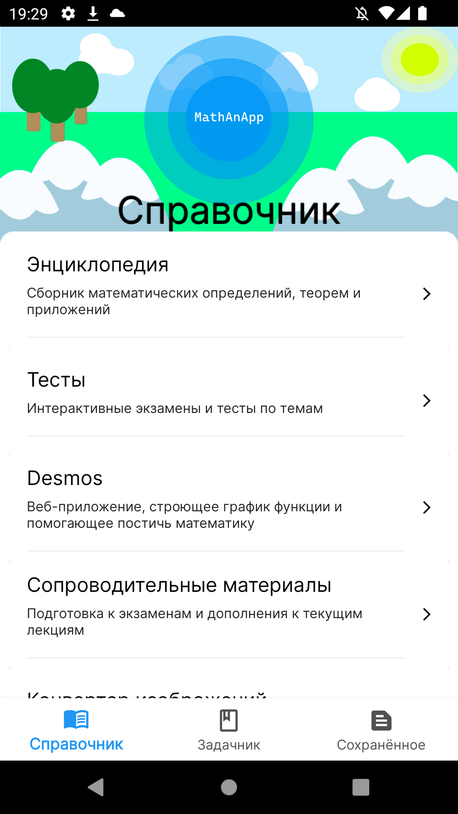
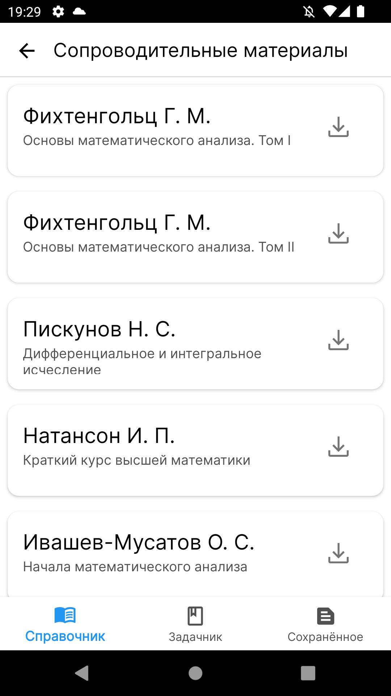
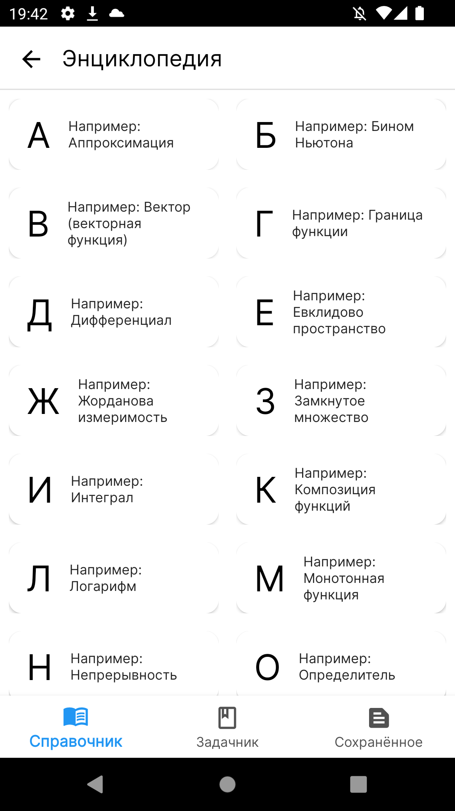
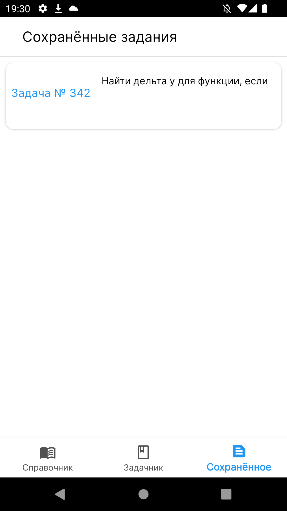
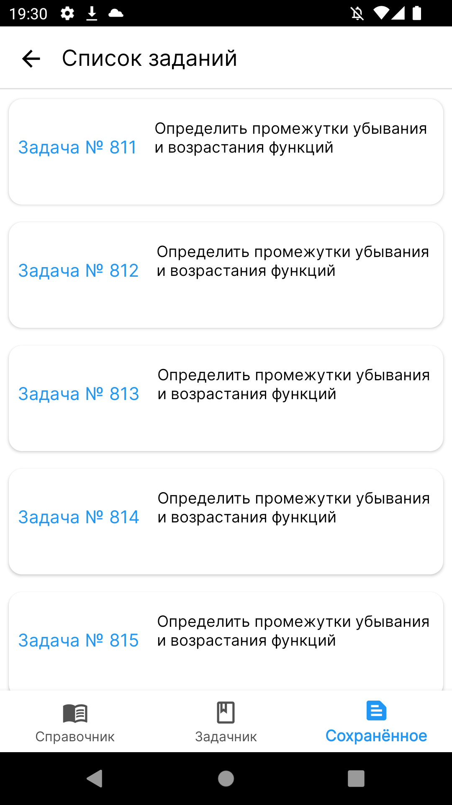
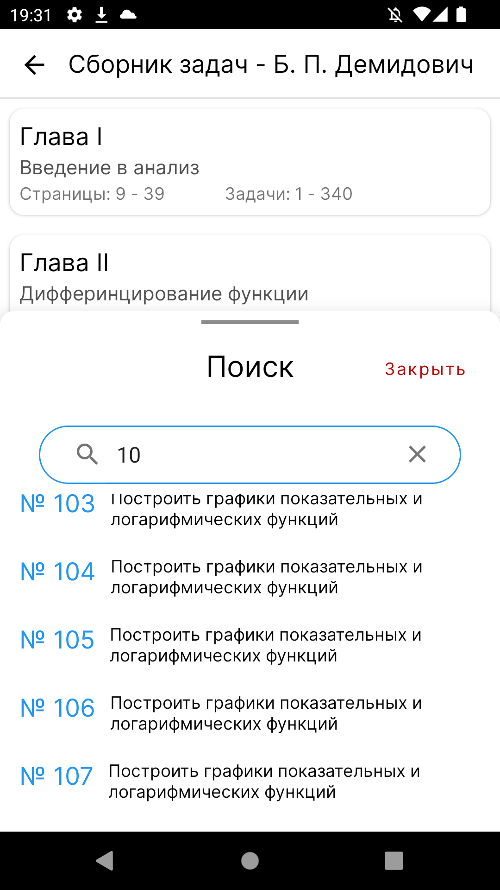
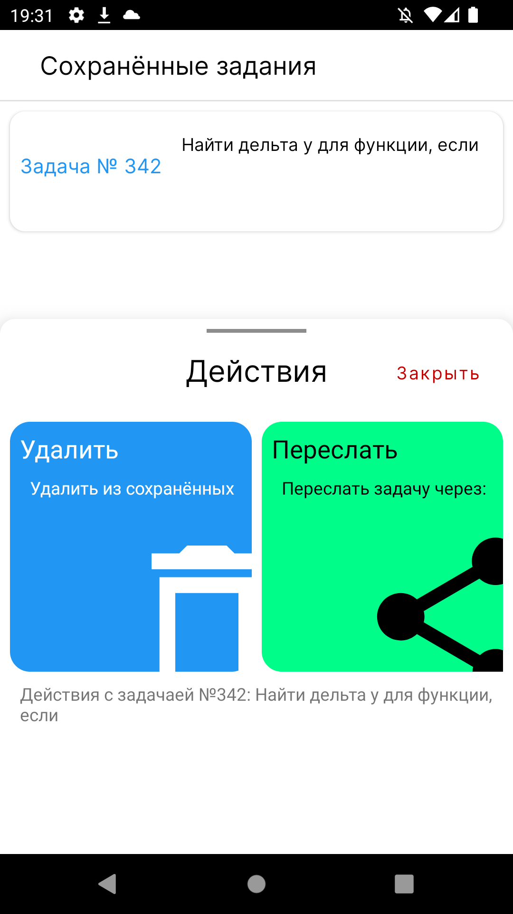
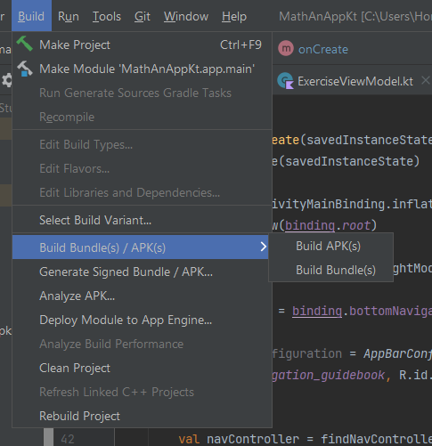
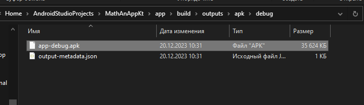

## macgood, qeca, paveq, kirill_tsvetkov presents:

<h2 align="center"> MathApp - Приложение для математики</h2>

<h2 align="center"> Что можно делать?</h2>

 

<h3 align="center">Скачать самые важные учебники по математике!</h3>

 

<h3 align="center">Выучить самые важные термины</h3>

 

<h3 align="center">Порешать Демидовича!</h3>

 

<h3 align="center">Сохранить самые любимые или оставить решение на потом!</h3>

 

<h3 align="center">Решить все задания из учебника!</h3>

 

<h3 align="center">Найти ту самую!</h3>

 

<h3 align="center">Переслать другу, чтобы он тоже попробовал решить!</h3>

 

<h2 align="center">Воспользоваться приложением?</h2>

## 1. Скачать

### Зайти на github в папку blob https://github.com/mrmacgood71/suai-math-app/tree/main/blob
### Скачать app-debug.apk

## 2. Собрать

### Зайти в Android Studio и нажать build -> Build Bundle(s) / APK (s) -> Build APK(s)

 

### Результат будет в C:\Users\*Имя пользователя*\AndroidStudioProjects\MathAnAppKt\app\build\outputs\apk\debug

 

## И можно пользоваться!

<h3 align="center">и многое другое......</h3>